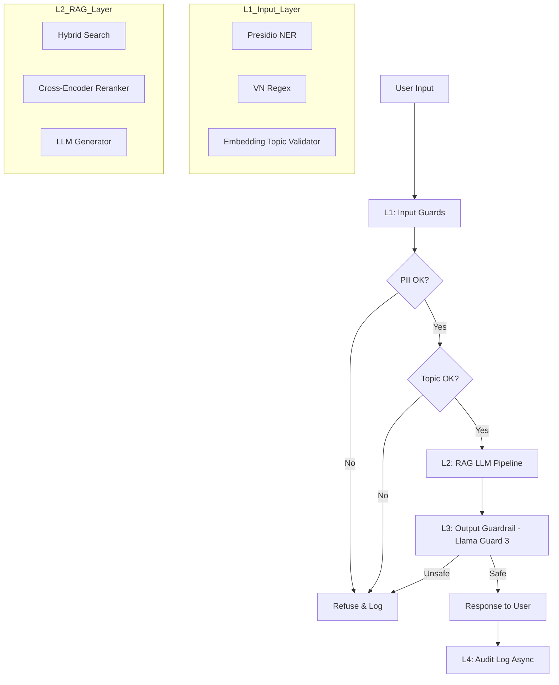

# Blueprint Document - Lab 24: Full Evaluation & Guardrail System

## Overview
This document outlines the architecture, service-level objectives (SLOs), and operational procedures for the production-ready RAG evaluation and guardrail system.

---

## Section 1: SLO Definition

| Metric | Target | Alert Threshold | Severity |
|---|---|---|---|
| Faithfulness | ≥ 0.85 | < 0.80 for 30 min | P2 |
| Answer Relevancy | ≥ 0.80 | < 0.75 for 30 min | P2 |
| Context Precision | ≥ 0.70 | < 0.65 for 1h | P3 |
| Context Recall | ≥ 0.75 | < 0.70 for 1h | P3 |
| P95 Latency (with guardrails) | < 2.5s | > 3s for 5 min | P1 |
| Guardrail Detection Rate | ≥ 90% | < 85% | P2 |
| False Positive Rate | < 5% | > 10% | P2 |

---

## Section 2: Architecture Diagram

---

## Section 3: Alert Playbook

### Incident 1: Faithfulness drops < 0.80
**Severity:** P2
**Detection:** Continuous evaluation monitoring alert.
**Likely Causes:**
1. Retriever returning low-quality chunks (Check Context Precision).
2. LLM model version drift or prompt changes.
3. Outdated document index after corpus updates.
**Investigation Steps:**
1. Correlate with Context Precision; if CP is down, the issue is in the retriever.
2. Check recent prompt changes in version control.
3. Verify if re-indexing was successful after the last document update.
**Resolution:**
- Tune retriever top-k or update reranker weights.
- Rollback prompt changes if drift is detected.
- Trigger a full re-indexing of the document corpus.

### Incident 2: P95 Latency > 3s
**Severity:** P1
**Detection:** Infrastructure monitoring alert.
**Likely Causes:**
1. LLM API (OpenAI/Anthropic) experiencing high latency.
2. Heavy load on self-hosted reranker or guardrail models.
3. Sequential execution of parallelizable tasks.
**Investigation Steps:**
1. Check cloud provider status pages.
2. Monitor GPU/CPU utilization on host machines.
3. Analyze trace logs to identify which layer (L1, L2, or L3) is the bottleneck.
**Resolution:**
- Switch to a lighter LLM model (e.g., gpt-4o-mini) as a temporary fallback.
- Scale up compute resources for self-hosted components.
- Optimize async/await logic to ensure parallel execution of guards.

---

## Section 4: Cost Analysis (Estimated)

*Assumption: 100,000 queries per month.*

| Component | Unit Cost | Volume | Monthly Cost |
|---|---|---|---|
| RAG Generation (GPT-4o-mini) | $0.001/q | 100k | $100 |
| RAGAS Continuous Eval (1% sample) | $0.01/q | 1k | $10 |
| LLM Judge (GPT-4o-mini) | $0.001/q | 10k | $10 |
| Presidio (Self-hosted) | $0 | 100k | $0 |
| Llama Guard 3 (via Groq/API) | $0 | 100k | $0 |
| **Total** | | | **$120** |

### Cost Optimization Opportunities
1. **Model Distillation:** Use smaller, fine-tuned models for specific classification tasks (e.g., Topic Guard).
2. **Caching:** Implement semantic caching for frequent queries to skip LLM generation and guardrail costs.
3. **Sampling Strategy:** Adjust RAGAS sampling rate based on traffic volume and historical stability.
